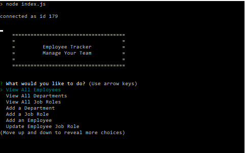
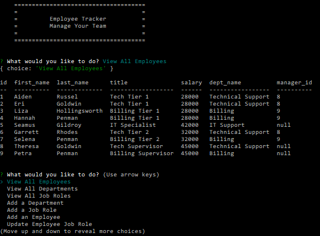

  # Employee Tracker 
         

  Easily track and manage employees with a MySQL database. You can view departments, roles, and employees, as well as make changes such as adding any of the above, or adjusting employee roles.

  ## Table of Contents

  * [Installation](#installation)
  * [Usage](#usage)
  * [Contribute](#contribute)
  * [Tests](#tests)
  * [License](#license)
  * [Questions](#questions)
  
  ## Screenshots
  
  
  
  
  ## Demonstration Video
  [Link to Demonstration](https://drive.google.com/file/d/1oLnwYsLt03PmK163tbfXXxpcot4VhS2w/view)
    
  ## Installation
  
  * Installation requires MySQL to already be installed
  * Clone repo to a local drive

  ## Usage
  
  * Using MySQL terminal, run "source db/schema.sql" to load database
  * After you can either load data yourself, or use "source db/seeds.sql" to load test data

  ## Contribute
  
  * No profanity, racially charged comments, or sexual innuendo
  * Keep all commits and comments on topic and free of spelling errors.

  ## Tests
  
  * None at this time

  ## License
  Licensed under the MIT license.

  ## Questions
  If you have any questions, concerns, or suggestions, you can reach me by emailing me at kevindivy@gmail.com. 
      
  You can also view more of my applications on my [GitHub page](https://github.com/kevin-ivy)
